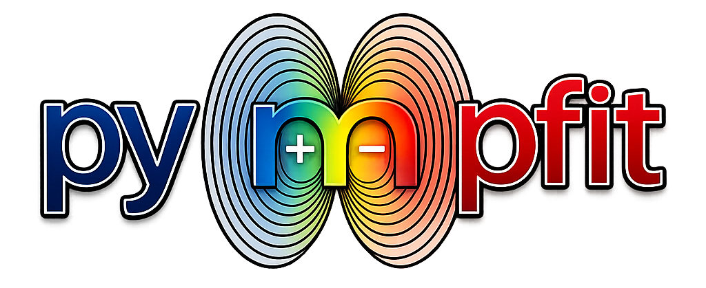

<div align="center">



[](https://github.com/shehan807/pympfit/actions/workflows/ci.yaml)
[](https://codecov.io/gh/shehan807/pympfit)
[](https://pympfit.readthedocs.io/en/latest/?badge=latest)

</div>

PyMPFIT is a free, open-source software for performing partial atomic charge fitting using the Gaussian distributed multipole analysis (GDMA). Features include:

* Built on open-source libraries: [OpenFF Recharge](https://github.com/openforcefield/openff-recharge), [OpenFF Toolkit](https://github.com/openforcefield/openff-toolkit), and [NumPy](https://numpy.org/)
* Direct interface to [Psi4](https://psicode.org/) / [GDMA](https://github.com/psi4/gdma) and from wavefunctions stored within [QCFractal](https://github.com/MolSSI/QCFractal) (i.e., [QCArchive](https://qcarchive.molssi.org/))
* Generating multipole moments for multi-conformer molecules
* An SQLite database backend for efficient high-throughput scaling
* Bayesian methods ([Pyro](https://pyro.ai/)) for flexible virtual site fitting

## Installation

**Install from source:**

```bash
git clone https://github.com/shehan807/pympfit.git
cd pympfit
pip install -e .
```

**Note:** GDMA functionality requires Psi4 and PyGDMA:

```bash
pip install psi4 pygdma
```

## Quick Example

```python
from openff.toolkit import Molecule
from openff.recharge.utilities.molecule import extract_conformers
from pympfit import (
    GDMASettings, Psi4GDMAGenerator, MoleculeGDMARecord,
    MPFITSVDSolver, generate_mpfit_charge_parameter,
)

# Create molecule
molecule = Molecule.from_smiles("CCO")
molecule.generate_conformers(n_conformers=1)
[conformer] = extract_conformers(molecule)

# Compute multipoles via Psi4/GDMA
settings = GDMASettings(method="pbe0", basis="def2-SVP", limit=4)
coords, multipoles = Psi4GDMAGenerator.generate(
    molecule, conformer, settings, minimize=True
)

# Fit partial charges to multipoles
record = MoleculeGDMARecord.from_molecule(molecule, coords, multipoles, settings)
charges = generate_mpfit_charge_parameter([record], MPFITSVDSolver())

import numpy as np

print(f"MPFIT SMILES         : {charges.smiles}")
print(f"MPFIT CHARGES        : {np.round(charges.value, 4)}")
```

Output:
```
MPFIT SMILES         : [H:1][O:2][C:3]([H:4])([H:5])[C:6]([H:7])([H:8])[H:9]
MPFIT CHARGES        : [ 0.34    0.6064 -0.6405 -0.1101 -0.1218 -0.113  -0.1281 -0.1534  0.3205]
```

See [`examples/tutorials/quickstart.py`](examples/tutorials/quickstart.py) for more.

## License

The main package is released under the [MIT license](LICENSE).

## Copyright

Copyright (c) 2026, Shehan M. Parmar

### Acknowledgements

Project based on the [Computational Molecular Science Python Cookiecutter](https://github.com/molssi/cookiecutter-cms) version 1.11.
